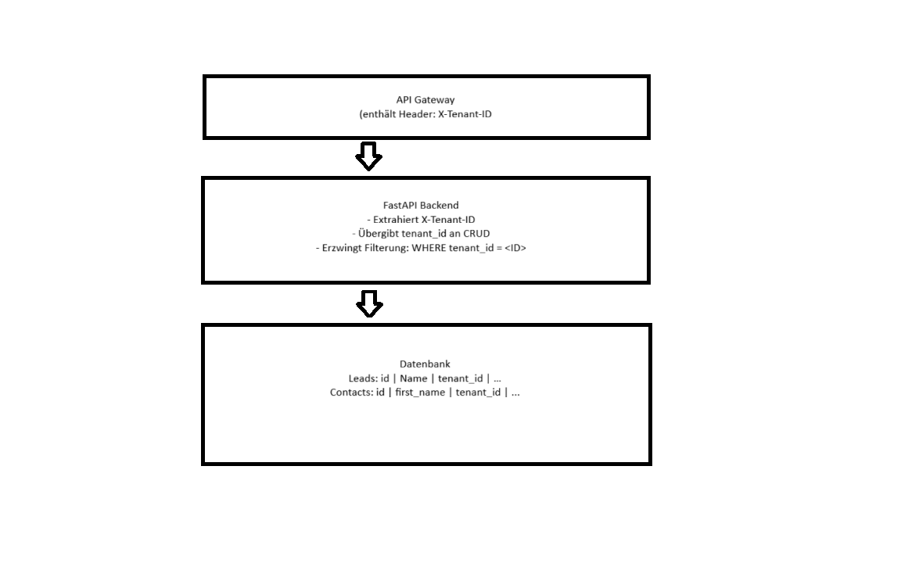

# Mini Lead CRM

Ein kleines Lead-Management-System (CRM) mit Backend (FastAPI + SQLite) und Frontend (React + TypeScript + Vite).  
Es erlaubt Leads zu erstellen, optionale Primärkontakte mit E-Mails zu hinterlegen, Leads zu filtern, zu suchen und den Status zu ändern.

---

## Problemwahl

Sales-Teams müssen Leads effizient verwalten, um Chancen nicht zu verpassen. Ziel dieses Features ist es, Leads zu erstellen, zu priorisieren, nach Status zu filtern und den primären Kontakt inklusive E-Mail zu verwalten.

- **Nutzen:** Sales-Teams können sich auf Leads mit höchster Priorität konzentrieren.
- **Pain Point:** Ohne strukturierte Lead-Verwaltung gehen wichtige Opportunities verloren.

**Mandanten-Isolation (light):**

- Alle Tabellen enthalten `tenant_id`
- Backend filtert alle Queries auf `X-Tenant-ID`
- **Trade-Off:** Tenant-ID via Header = einfache Mandanten-Isolation, keine Authentifizierung im Prototyp

---

## Tech-Stack

**Backend:**  
- Python 3.11+  
- FastAPI  
- SQLAlchemy 2.x  
- SQLite (für schnelles Setup)  
- Pydantic (Validierung)

**Frontend:**  
- React 18 + TypeScript + Vite  
- TanStack Query (State & Data Fetching)  
- zod (Formularvalidierung)

**Extras / Optional:**  
- Vitest + React Testing Library für Tests  
- Debounce für Suchfeld im Frontend  
- Logging via `uvicorn`  

---

## Datenmodell

**Leads**  
- `id`: Integer, PK  
- `name`: String, Pflichtfeld  
- `domain`: String, optional  
- `status`: Enum (`new`, `qualified`, `lost`), Default=`new`  
- `created_at`: UTC Timestamp  
- `primary_contact_id`: FK zu Contacts, optional  
- `tenant_id`: String, Mandanten-ID
- `priority`: Integer, automatisch berechnet

**Contacts**  
- `id`: Integer, PK  
- `first_name`: String, optional  
- `last_name`: String, optional  
- `tenant_id`: String

**ContactEmails**  
- `id`: Integer, PK  
- `contact_id`: FK zu Contacts  
- `value`: String, E-Mail  
- `is_primary`: Boolean, Default=False  
- Constraints: Eindeutige E-Mail pro Kontakt (`lower(value)`), genau eine Primary

---

## Lead-Priorisierung

Leads werden automatisch bewertet, um Sales-Fokus auf die wichtigsten Leads zu gewährleisten.

**Kriterien & Punktevergabe:**

| Kriterium                | Bedingung                  | Punkte |
|---------------------------|---------------------------|--------|
| Lead-Status               | new                       | 10     |
|                           | qualified                 | 50     |
|                           | lost                      | 0      |
| Primärkontakt vorhanden   | Ja                        | 20     |
| Domain vorhanden          | Ja                        | 10     |
| Unternehmensgröße         | <50 Mitarbeiter           | 10     |
|                           | 50–200 Mitarbeiter        | 20     |
|                           | >200 Mitarbeiter          | 30     |
| Branche                   | Tech / Finanzen / Healthcare | 15  |
| Letzte Aktivität          | <7 Tage                   | 20     |
|                           | 7–30 Tage                 | 10     |
|                           | >30 Tage                  | 0      |

- Summe ergibt **Priorität (0–145)**
- Leads werden **im Backend nach `priority DESC`** sortiert
- Neue Leads mit hohem Potenzial erscheinen automatisch oben

**Beispiel-Flow:**

1. Sales-User erstellt einen neuen Lead mit primärem Kontakt und E-Mail
2. Backend berechnet Priorität automatisch
3. Lead erscheint in Liste mit Priorität, Status und primärem Kontakt

---

## API Endpoints

### 1. `POST /leads`
- Erstellt einen Lead, optional mit Primärkontakt + E-Mails  
- Body: `LeadCreate` Schema
- Response: 201 Created mit LeadRead

### 2. `GET /leads`
- Listet Leads mit Filter und Pagination
- Query Params:
  - `q` (optional): Suche über `name` oder `domain`
  - `status` (optional): `new` | `qualified` | `lost`
  - `limit` (optional): max 200, Default 20
  - `offset` (optional): Default 0
- Header: X-Tenant-ID (Mandantenfilter)
- Response: `{ items: LeadRead[], total: number }`

### 3. `POST /leads/{id}/status` (Bonus)
- Ändert den Status eines bestehenden Leads  
- Query: `new_status`  
- Response: Aktualisierter Lead (`LeadRead`)

---

## Frontend

- **Seite:** Single Page, zeigt alle Leads  
- **Funktionen:**  
  - Liste der Leads  
  - Suchfeld mit Debounce  
  - Status-Dropdown Filter  
  - Formular zum Anlegen eines Leads mit optionalem Primärkontakt  
  - Status kann direkt in der Liste geändert werden (Inline Edit + Badge)  

---

## Tests

**Backend:**  
- Pytest  
- Testet Lead-Erstellung und GET /leads  

**Frontend:**  
- Vitest + React Testing Library  
- Testet Öffnen des Formulars und UI Interaktion  

---

## Setup & Start

### Backend

```bash
cd backend
python -m venv .venv
source .venv/bin/activate  # Windows: .venv\Scripts\activate
pip install -r requirements.txt
uvicorn app.main:app --reload
```

## Abstriche / Trade-offs

### SQLite statt PostgreSQL
- SQLite für schnelles Setup und lokale Entwicklung.  
- **Vorteil:** Kein Docker/Postgres nötig, schnelle Tests.  
- **Nachteil:** Manche fortgeschrittenen Constraints sind nicht nativ möglich.

### Primary-Email Partial-Unique
- In PostgreSQL könnte man einen Partial-Unique-Index auf `is_primary` erstellen, um sicherzustellen, dass jeder Kontakt genau eine Primary-Email hat.

### Keine Alembic-Migration
- SQLite ist klein, Tabellen werden direkt aus den SQLAlchemy-Models erstellt.  
- **Vorteil:** Einfacher Start, kein Setup-Aufwand.  
- **Nachteil:** Keine Versionierung von Schemaänderungen.

### Tests
- Nur Kern-Tests implementiert (Lead erstellen, GET /leads, einfache Frontend-Testfälle).  
- Kein umfassendes Test-Setup für alle Fehlerfälle oder E-Mail-Validierungen.

### Tenant-ID via Header
- Einfache Mandanten-Isolation, keine Auth im Prototyp.

### Priorisierung im Backend
- Einheitliche Berechnung, automatisch auf Basis Lead-Daten.
- Berechnung anhand von Nutzereingaben möglich.

---

## Persistenz & Mandantenbewusstsein

- Tabellen: `leads`, `contacts`, `contact_emails`
- Alle Tabellen enthalten `tenant_id`
- Backend filtert alle Anfragen per `X-Tenant-ID`
- Leads/Kontakte verschiedener Tenants sind isoliert



---

## Einschätzungsfragen

### Tech-Stack
- Backend: Python + FastAPI → Typensicherheit, Async, moderne API
- Frontend: React + Axios → Komponenten-basiert, einfache State-Verwaltung
- DB: SQLAlchemy + SQLite/Postgres → ORM für saubere DB-Interaktion

### End-to-End Interface
- Variante: UI + API
- Grund: Ein Sales-User benötigt eine intuitive visuelle Oberfläche, um Leads schnell zu erfassen, zu priorisieren und den Status zu ändern. Die API sorgt dabei für saubere Trennung von Frontend und Backend, ermöglicht einfache Testbarkeit und potenziell zukünftige Integration mit anderen Systemen oder mobilen Apps.
- Flow (Sales-User):
  1. Formular zum Anlegen eines Leads → POST /leads
  2. Lead erscheint in Liste mit Priorität
  3. Status direkt in Liste ändern → POST /leads/{id}/status
  4. Filterung nach Status oder Suche möglich

### Observability
- Logs: strukturierte Logs (uvicorn.error) mit Tenant-ID, Lead-ID, Statusänderungen
- Metrics: Anzahl Leads pro Tenant, durchschnittliche Priorität, Response Time
- Alerting: 5xx Errors, fehlgeschlagene DB-Transaktionen, Performance-Latenzen

### Frontend State / Fetching
- **State Management & Data Fetching:** TanStack Query (React Query) wird genutzt, um API-Requests zu verwalten, Caching zu ermöglichen und Server-Data synchron zu halten.
- **Loading & Error States:** Jeder API-Request hat eigene Loading- und Error-Zustände, die direkt in der UI angezeigt werden (z. B. Spinner oder Error-Badge).
- **Optimistic Updates:** Statusänderungen bei Leads werden direkt in der UI aktualisiert, bevor die Server-Antwort zurückkommt. Dadurch wirkt die UI reaktionsschneller.
- **Pagination & Sorting:** Kleinere Datenmengen werden clientseitig sortiert, für größere Datenmengen wird serverseitige Pagination genutzt.

### Performance & Skalierung
- Engpass: Backend-Filterung bei großen Tabellen
- Lösung: DB-Index auf tenant_id, status, priority
- Option: serverseitige Sortierung und Pagination, Async Queries, Caching

### Produktnutzen
- Sales-Persona: Account Executive / Sales Manager
- Impact: Fokus auf wichtige Leads, höhere Conversion-Rate, schnellere Entscheidungen

### Next Steps
- Authentifizierung (JWT / OAuth) pro Tenant
- Activity Log / Lead History
- Filter & Suche optimieren für große Datenmengen (DB-Index, serverseitige Sortierung)
- Multi-Tenant UI (Tenant-Switcher, Übersicht pro Team)

---

## Mögliches Deployment

### Docker Compose
```
version: "3"
services:
  backend:
    build: ./backend
    ports:
      - "8000:8000"
    environment:
      - DATABASE_URL=sqlite:///./db.sqlite3
  frontend:
    build: ./frontend
    ports:
      - "5173:5173"
```

---

## SQLite-Einschränkungen

| Feature | PostgreSQL | SQLite | Umsetzung im Projekt |
|---------|------------|--------|--------------------|
| Case-insensitive UNIQUE | ✅ unterstützt | ❌ nicht nativ | Über Python-Code beim Erstellen von E-Mails geprüft |
| Partial Unique Index (`is_primary`) | ✅ direkt in DB | ❌ nicht nativ | In `crud.py` geprüft: mindestens eine Primary-Email wird gesetzt |
| Foreign Keys + ON DELETE SET NULL | ✅ unterstützt | ✅ unterstützt ab SQLite 3.6.19 | Primary-Contact-FK korrekt gesetzt/gelöscht |
| Datetime UTC default | ✅ problemlos | ✅ funktioniert | Mit `datetime.now(timezone.utc)` gelöst |
| Transactions | ✅ unterstützt | ✅ unterstützt | `with db.begin():` im Backend für konsistente Inserts |

**Fazit:**  
SQLite ist ideal für die Challenge wegen einfacher Einrichtung, aber Features wie Partial-Unique Constraints oder Case-Insensitive UNIQUE müssen durch Python-Code umgesetzt werden. In PostgreSQL wären diese Constraints direkt in der Datenbank möglich.
